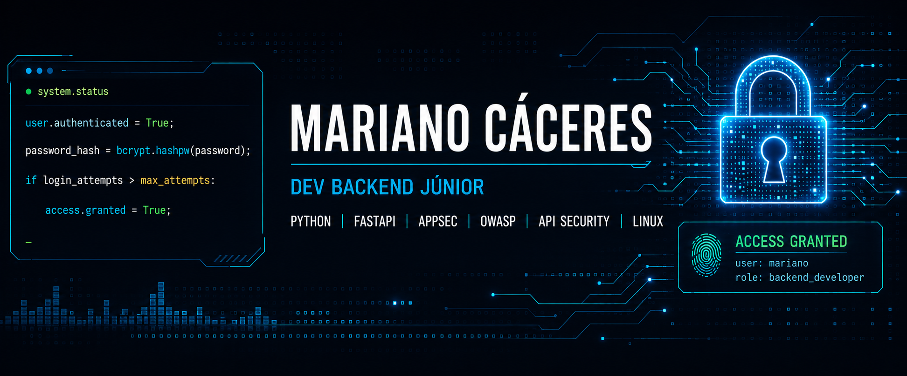

<div align="center">



<h3>BACKEND · PYTHON · FASTAPI · APPSEC · CYBERSECURITY</h3>

<p>
  
  
  
  
  
  
</p>

<p>
  <strong>Building secure applications while growing as a software engineer.</strong>
</p>

</div>

---

## About Me

I'm a **Software Engineering and Cybersecurity** student, focused on **Backend Development, Python, FastAPI, and Application Security (AppSec)**.

I build hands-on projects related to API development, authentication, authorization, access control, application security, and log analysis.

My professional positioning sits at the intersection of:

**Backend Development + Software Engineering + Application Security + Cybersecurity**

I'm currently seeking my first opportunity as a **Backend Development Intern, Junior Backend Developer, Cybersecurity Intern, or AppSec Intern**.

My goal is to build a solid foundation in software engineering and security, combining backend development with security practices from the very start of an application's design.

---

## Security Focus

My main technical focus is understanding how backend applications can be designed, implemented, tested, and protected with security in mind from the outset.

### Application Security

```text
OWASP Top 10
OWASP API Security Top 10
Secure Coding
Authentication
Authorization
Access Control
BOLA
JWT
Password Hashing
Input Validation
API Security
Brute-force Protection
Account Lockout
Log Analysis
Linux Security
```

My goal isn't just to implement features, but to understand **how an application can fail, how it can be abused, and which controls can reduce those risks**.

> Security should be part of the development process from the beginning.

---

## Kali Linux & Cybersecurity Environment

I'm currently using **Kali Linux as my main and only operating system**, directing my study environment toward **Cybersecurity, Application Security, Linux Security, and secure development**.

I use Kali Linux as my primary environment to deepen my knowledge of:

* Linux
* Terminal and CLI
* Networking
* Application Security
* Web Security
* API Security
* OWASP
* Log Analysis
* Security Testing
* Reconnaissance
* Vulnerability Analysis
* Secure Development
* Cybersecurity Tools

My goal is to build real familiarity with a security-oriented Linux environment, using the command line and security tools as part of my daily study and development process.

**Current Environment**

```text
Operating System
└── Kali Linux

Primary Focus
├── Cybersecurity
├── Application Security
├── Backend Security
├── API Security
├── Linux Security
└── Security Testing
```

---

## Technical Stack

### Backend Development

**Python · FastAPI · SQLAlchemy · REST APIs · SQL**

### Application Security

**OWASP · AppSec · Secure Coding · Authentication · Authorization · API Security · BOLA**

### Linux & Cybersecurity

**Kali Linux · Linux · CLI · SSH · Log Analysis · Security Testing**

### Tools & Environment

**Git · GitHub · JSON · CSV · Terminal**

---

# Featured Projects

## 🔐 secure-auth-api

Secure REST API authentication built with **Python and FastAPI**.

A project developed to study authentication mechanisms, credential protection, and security controls in backend applications.

### Security Focus

* Password hashing with bcrypt
* JWT authentication
* Password policy
* Login attempt control
* Account lockout
* Input validation
* Database persistence
* Authentication controls

### Authentication Flow

```text
                   ┌─────────────────┐
                   │      USER       │
                   └────────┬────────┘
                            │
                            ▼
                   ┌─────────────────┐
                   │  LOGIN REQUEST  │
                   └────────┬────────┘
                            │
                            ▼
                   ┌─────────────────┐
                   │    VALIDATE     │
                   │   CREDENTIALS   │
                   └────────┬────────┘
                            │
                    ┌───────┴───────┐
                    │               │
                 INVALID          VALID
                    │               │
                    ▼               ▼
             ┌─────────────┐  ┌─────────────┐
             │    TRACK    │  │  GENERATE   │
             │   ATTEMPT   │  │     JWT     │
             └──────┬──────┘  └──────┬──────┘
                    │                │
                    ▼                ▼
             ┌─────────────┐  ┌─────────────┐
             │  PROTECTION │  │ AUTHENTICATED│
             └─────────────┘  │   REQUEST    │
                              └─────────────┘
```

### Technologies

**Python · FastAPI · SQLAlchemy · JWT · bcrypt · SQL**

---

## 🔐 secure-crud-api

REST API focused on **authentication, authorization, and user-level data isolation**.

A project built with Python + FastAPI to study access control, authorization, and resource isolation between users.

The main security concept studied in this project is:

**BOLA — Broken Object Level Authorization**

### Security Focus

* Authentication
* Authorization
* Access Control
* User Data Isolation
* Resource Ownership Validation
* Input Validation
* CRUD
* API Security
* BOLA Prevention

### Authorization Flow

```text
              AUTHENTICATED USER
                       │
                       ▼
                ┌─────────────┐
                │ API REQUEST │
                └──────┬──────┘
                       │
                       ▼
               ┌───────────────┐
               │    RESOURCE   │
               │    LOOKUP     │
               └───────┬───────┘
                       │
                       ▼
             ┌───────────────────┐
             │ OWNERSHIP / ACCESS│
             │    VALIDATION     │
             └─────────┬─────────┘
                       │
                 ┌─────┴─────┐
                 │           │
               ALLOWED      DENIED
                 │           │
                 ▼           ▼
          ┌────────────┐  ┌─────────┐
          │  RESOURCE  │  │   403   │
          │   ACCESS   │  │ FORBIDDEN│
          └────────────┘  └─────────┘
```

### Technologies

**Python · FastAPI · SQLAlchemy · SQL · REST API · OWASP**

---

## 🔎 log-analyzer-python

CLI for analyzing **SSH and Apache** logs.

A tool developed in Python for log analysis, focused on identifying patterns potentially related to **brute force, scanning, and other suspicious behavior**.

### Features

* SSH log analysis
* Apache log analysis
* Brute-force detection
* Scanning patterns
* CSV reports
* JSON reports
* CLI interface

### Technologies

**Python · Kali Linux · Linux · CLI · SSH · Apache · CSV · JSON**

---

# Software Engineering

Beyond implementing features, I aim to build an engineering mindset around the applications I develop.

### Engineering Practices

* Clean Code
* Separation of Responsibilities
* Input Validation
* Error Handling
* Authentication
* Authorization
* Database Persistence
* Documentation
* Testing
* Git
* Secure Coding
* Application Security

My goal is to develop software that is:

```text
SECURE
   ↓
MAINTAINABLE
   ↓
TESTABLE
   ↓
DOCUMENTED
   ↓
SUSTAINABLE
```

---

# Security Mindset

My development and study approach follows a security-driven cycle:

```text
┌───────────────┐
│   UNDERSTAND  │
└───────┬───────┘
        ↓
┌───────────────┐
│     DESIGN    │
└───────┬───────┘
        ↓
┌───────────────┐
│     BUILD     │
└───────┬───────┘
        ↓
┌───────────────┐
│    VALIDATE   │
└───────┬───────┘
        ↓
┌───────────────┐
│      TEST     │
└───────┬───────┘
        ↓
┌───────────────┐
│     SECURE    │
└───────┬───────┘
        ↓
┌───────────────┐
│   DOCUMENT    │
└───────┬───────┘
        ↓
┌───────────────┐
│    IMPROVE    │
└───────────────┘
```

The goal isn't just to make an application work.

It's to understand **how it can fail, how it can be abused, and how its controls can be improved**.

---

# Currently Learning

## Backend Development

**Python · FastAPI · SQL · SQLAlchemy · REST APIs**

## Cybersecurity

**Kali Linux · OWASP · Application Security · API Security · Secure Coding · Linux Security**

## Software Engineering

**Testing · Software Architecture · Git · Linux · CI/CD**

---

# Complementary Experience

I've also developed a project related to:

**Python · pandas · Data Cleaning · Data Validation · Data Quality**

The project uses a fictional clinical study dataset to practice cleaning, validation, inconsistency identification, and data quality analysis.

This area represents complementary experience.

### Main Professional Focus

**Backend Development + Application Security + Cybersecurity**

---

# Professional Goal

I'm seeking my first professional opportunity as a:

* Backend Development Intern
* Junior Backend Developer
* Cybersecurity Intern
* AppSec Intern

I'm interested in **on-site, hybrid, or remote** opportunities.

### Areas of Interest

* Python
* Backend Development
* REST APIs
* Databases
* Authentication
* Authorization
* API Security
* Application Security
* Software Engineering
* Cybersecurity
* Linux
* Kali Linux

My goal is to grow professionally by building applications that are:

**secure · organized · testable · documented · sustainable**

---

# Development Focus

```text
                    BACKEND DEVELOPMENT
                           │
              ┌────────────┼────────────┐
              │            │            │
           Python       FastAPI       SQL
              │            │            │
              └────────────┼────────────┘
                           │
                           ▼
                  APPLICATION SECURITY
                           │
              ┌────────────┼────────────┐
              │            │            │
           OWASP    Authentication   Authorization
              │            │            │
              └────────────┼────────────┘
                           │
                           ▼
                  SOFTWARE ENGINEERING
                           │
              ┌────────────┼────────────┐
              │            │            │
         Clean Code      Testing     Documentation
              │            │            │
              └────────────┼────────────┘
                           │
                           ▼
                       SECURE
                       SOFTWARE
```

---

# Contact

<div align="center">

### Mariano Cáceres

**Backend Development · Python · FastAPI · Application Security**

📧 **[mariano.caceres.dev@gmail.com](mailto:mariano.caceres.dev@gmail.com)**

🔗 **linkedin.com/in/marianoccrs**

📍 **Rio de Janeiro, Brasil**

**BACKEND · PYTHON · APPSEC · CYBERSECURITY**

<sub>Building secure applications while growing as a software engineer.</sub>

</div>
