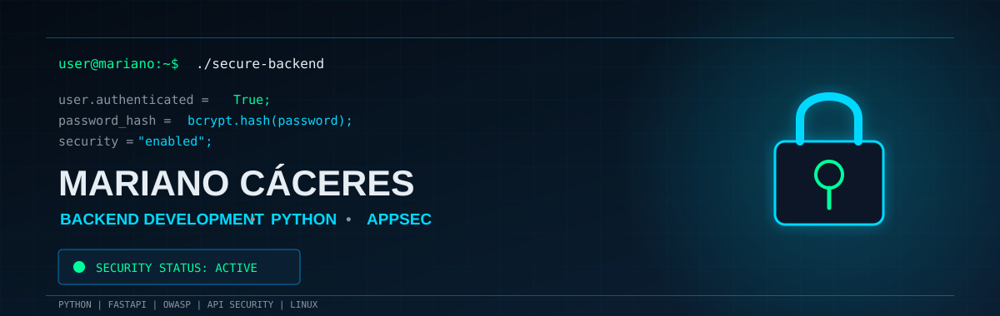

<div align="center">



<br><br>

<h3>BACKEND · PYTHON · FASTAPI · APPSEC · CYBERSECURITY</h3>

<p>
  
  
  
  
  
</p>

<p>
  <strong>Building secure applications while growing as a software engineer.</strong>
</p>

</div>

---

# 👨‍💻 About Me

Sou estudante de **Engenharia de Software e Cibersegurança**, com foco em **Backend Development, Python, FastAPI e Application Security (AppSec)**.

Estou construindo experiência prática por meio de projetos voltados para desenvolvimento de APIs, autenticação, autorização, controle de acesso, segurança de aplicações e análise de logs.

Busco minha primeira oportunidade como **Estagiário ou Desenvolvedor Backend Júnior**, com interesse em ambientes onde possa aprender com profissionais experientes e contribuir para o desenvolvimento de software seguro.

Meu objetivo é combinar:

> **Software Engineering + Backend Development + Cybersecurity**

para construir aplicações mais seguras desde a concepção.

---

# 🛡️ Security Focus

Meu principal interesse está na interseção entre **desenvolvimento backend e segurança de aplicações**.

### Application Security

```text
OWASP Top 10
OWASP API Security Top 10
Secure Coding
Authentication
Authorization
Access Control
BOLA
JWT
Password Hashing
Input Validation
API Security
Log Analysis
Linux Security

Acredito que segurança não deve ser uma etapa adicionada depois que a aplicação está pronta.

    Security should be part of the development process from the beginning.

⚙️ Technical Stack
Backend Development

Python · FastAPI · SQLAlchemy · REST APIs · SQL
Cybersecurity

OWASP · AppSec · Secure Coding · Authentication · Authorization · API Security
Tools & Environment

Linux · Git · GitHub · CLI · JSON · CSV
🚀 Featured Security Projects
🔐 Secure Auth API

    Secure REST API authentication built with Python and FastAPI.

API REST desenvolvida para estudar autenticação, proteção de credenciais e segurança de aplicações backend.
Security Features

    Password hashing com bcrypt
    JWT authentication
    Política de senhas
    Controle de tentativas de login
    Account lockout
    Input validation
    Database persistence
    Authentication controls

Authentication Flow

                   ┌─────────────────┐
                   │      USER       │
                   └────────┬────────┘
                            │
                            ▼
                   ┌─────────────────┐
                   │  LOGIN REQUEST  │
                   └────────┬────────┘
                            │
                            ▼
                   ┌─────────────────┐
                   │    VALIDATE     │
                   │   CREDENTIALS   │
                   └────────┬────────┘
                            │
                    ┌───────┴───────┐
                    │               │
                  INVALID         VALID
                    │               │
                    ▼               ▼
             ┌─────────────┐  ┌─────────────┐
             │    TRACK    │  │  GENERATE   │
             │   ATTEMPT   │  │     JWT     │
             └──────┬──────┘  └──────┬──────┘
                    │                │
                    ▼                ▼
             ┌─────────────┐  ┌─────────────┐
             │  PROTECTION │  │ AUTHENTICATED│
             └─────────────┘  │   REQUEST    │
                              └─────────────┘

Technologies

Python · FastAPI · SQLAlchemy · JWT · bcrypt · SQL
🔐 Secure CRUD API

    REST API focused on authentication, authorization and user-level data isolation.

API REST desenvolvida com Python + FastAPI, com foco em controle de acesso, autorização e isolamento de dados entre usuários.

O principal conceito de segurança estudado neste projeto é:

    BOLA — Broken Object Level Authorization

Security Focus

    Authentication
    Authorization
    Access Control
    User Data Isolation
    Resource Ownership Validation
    Input Validation
    CRUD
    API Security
    BOLA Prevention

Authorization Flow

              AUTHENTICATED USER
                       │
                       ▼
                ┌─────────────┐
                │ API REQUEST │
                └──────┬──────┘
                       │
                       ▼
               ┌───────────────┐
               │    RESOURCE   │
               │    LOOKUP     │
               └───────┬───────┘
                       │
                       ▼
             ┌───────────────────┐
             │ OWNERSHIP / ACCESS│
             │    VALIDATION     │
             └─────────┬─────────┘
                       │
                 ┌─────┴─────┐
                 │           │
               ALLOWED      DENIED
                 │           │
                 ▼           ▼
          ┌────────────┐  ┌─────────┐
          │  RESOURCE  │  │   403   │
          │  ACCESS    │  │ FORBIDDEN│
          └────────────┘  └─────────┘

Technologies

Python · FastAPI · SQLAlchemy · SQL · REST API · OWASP
🔎 Log Analyzer Python

    CLI for SSH and Apache log analysis.

Ferramenta desenvolvida em Python para análise de logs SSH e Apache, identificando padrões potencialmente relacionados a brute force, scanning e outros comportamentos suspeitos.
Features

    SSH log analysis
    Apache log analysis
    Brute-force detection
    Scanning patterns
    CSV reports
    JSON reports
    CLI interface

Technologies

Python · Linux · CLI · SSH · Apache · CSV · JSON
🧠 Software Engineering

Além de desenvolver funcionalidades, busco desenvolver uma visão de engenharia sobre as aplicações.
Practices

    Clean Code
    Separation of Responsibilities
    Input Validation
    Error Handling
    Authentication
    Authorization
    Database Persistence
    Documentation
    Testing
    Git
    Secure Coding
    Application Security

Meu objetivo é desenvolver software que seja:

SECURE
   ↓
MAINTAINABLE
   ↓
TESTABLE
   ↓
DOCUMENTED
   ↓
SCALABLE

🔐 Security Mindset

Meu processo de desenvolvimento e estudo segue uma abordagem orientada à segurança:

┌───────────────┐
│   UNDERSTAND  │
└───────┬───────┘
        ↓
┌───────────────┐
│     DESIGN    │
└───────┬───────┘
        ↓
┌───────────────┐
│     BUILD     │
└───────┬───────┘
        ↓
┌───────────────┐
│    VALIDATE   │
└───────┬───────┘
        ↓
┌───────────────┐
│      TEST     │
└───────┬───────┘
        ↓
┌───────────────┐
│     SECURE    │
└───────┬───────┘
        ↓
┌───────────────┐
│   DOCUMENT    │
└───────┬───────┘
        ↓
┌───────────────┐
│    IMPROVE    │
└───────────────┘

    O objetivo não é apenas fazer uma aplicação funcionar.

    É entender como ela pode falhar, como pode ser abusada e como seus controles podem ser melhorados.

📚 Currently Learning
Backend

Python · FastAPI · SQL · SQLAlchemy · REST APIs
Cybersecurity

OWASP · AppSec · API Security · Secure Coding
Software Engineering

Testing · Software Architecture · Git · Linux · CI/CD
🧪 Complementary Experience

Também possuo experiência prática em projetos relacionados a:

Python · pandas · Data Cleaning · Data Validation · Data Quality

Desenvolvi um projeto utilizando uma base fictícia de estudo clínico para praticar limpeza, validação, identificação de inconsistências e análise de qualidade de dados.

Essa área representa um interesse complementar.
Meu foco profissional principal:

    Backend Development + Application Security + Cybersecurity

🎯 Professional Goal

Busco minha primeira oportunidade como:

    Estagiário de Desenvolvimento Backend
    Desenvolvedor Backend Júnior
    Estagiário de Cybersecurity
    Estagiário de AppSec

Tenho interesse em trabalhar com:

    Python
    Backend Development
    APIs REST
    Bancos de Dados
    Authentication
    Authorization
    API Security
    Application Security
    Engenharia de Software
    Cybersecurity

Meu objetivo é evoluir como profissional construindo aplicações:

seguras · organizadas · testáveis · documentadas · sustentáveis
📊 Development Focus

Backend Development
        │
        ├── Python
        ├── FastAPI
        ├── REST APIs
        └── SQL
              │
              ▼
      Application Security
              │
        ├── OWASP
        ├── Authentication
        ├── Authorization
        ├── Access Control
        └── Secure Coding
              │
              ▼
      Software Engineering
              │
        ├── Clean Code
        ├── Testing
        ├── Documentation
        └── Git

📫 Contact
<div align="center">
Mariano Cáceres

Backend Development · Python · FastAPI · Application Security
<br>

📧 mariano.caceres.dev@gmail.com

🔗 LinkedIn: linkedin.com/in/marianoccrs

📍 Rio de Janeiro, Brasil
<br>
🔐 BACKEND · PYTHON · APPSEC · CYBERSECURITY
<br>

Building secure applications while growing as a software engineer.
</div> ``` 
