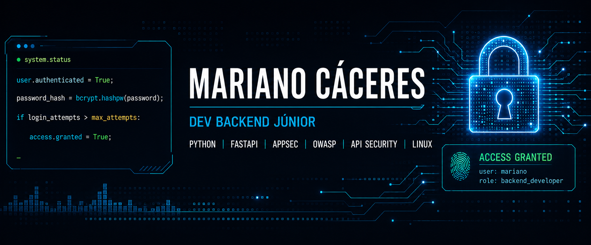

# Mariano Cáceres

### Desenvolvedor Backend Python Júnior · FastAPI · Segurança de Aplicações

  
  
  
  
  
  
  

  

🇧🇷 Estudante de Engenharia de Software e Cibersegurança no Rio de Janeiro &nbsp;·&nbsp; 🇺🇸 Junior Python backend developer building secure, tested REST APIs

---

## 👋 Sobre

Sou estudante de **Engenharia de Software** e **Cibersegurança** (Estácio) e construo APIs REST em **Python e FastAPI** aplicando segurança desde o design (**OWASP**). Cada projeto abaixo nasceu para resolver um risco real: autenticação, controle de acesso ou detecção de ataques em logs. Todos têm testes automatizados e decisões documentadas.

🎯 **Busco:** estágio ou vaga júnior em **Desenvolvimento Backend (Python)**, presencial/híbrido no Rio de Janeiro ou remoto. Também aberto a estágio em **AppSec / Cibersegurança**.

---

## 🚀 Projetos

| Projeto | O que faz | Destaques |
|---|---|---|
| [**secure-auth-api**](https://github.com/marianoccrs/secure-auth-api) Python · FastAPI · SQLite | API de autenticação segura | JWT com expiração de 15 min, senhas com bcrypt, política de senha forte, bloqueio temporário contra força bruta, logs estruturados sem dados sensíveis |
| [**secure-crud-api**](https://github.com/marianoccrs/secure-crud-api) Python · FastAPI · SQLite | CRUD com isolamento de dados por usuário | Prevenção de **BOLA/IDOR** (#1 do OWASP API Top 10), PBKDF2-HMAC-SHA256, **27 testes** incluindo tokens adulterados e SQL Injection |
| [**log-analyzer-python**](https://github.com/marianoccrs/log-analyzer-python) Python · CLI · pytest | Threat hunting em logs SSH e Apache | Detecta força bruta (janela deslizante por IP) e varreduras HTTP; relatórios JSON/CSV; generators para arquivos grandes |
| [**clinical-data-cleaning**](https://github.com/marianoccrs/clinical-data-cleaning) Python · pandas | Limpeza e validação de dados clínicos (dataset fictício) | Identificação de inconsistências e análise de qualidade de dados |

---

## 🧰 Stack

| | |
|---|---|
| **Backend** | Python · FastAPI · SQLAlchemy · Pydantic · REST APIs · SQL |
| **Segurança** | OWASP Top 10 · OWASP API Security Top 10 · JWT · bcrypt · BOLA/IDOR · prevenção a SQL Injection |
| **Qualidade e ferramentas** | pytest · Git/GitHub · Postman · Regex · CLI |
| **Ambiente** | Linux (Kali como sistema principal) · SSH · Wireshark · Nmap |
| **Dados** | pandas · limpeza e validação de dados |

---

## 🧭 Como eu trabalho

- **Segurança desde o design:** penso em como a aplicação pode falhar ou ser abusada antes de escrever o código.
- **Testado:** casos positivos e negativos com pytest, para reduzir falsos positivos e regressões.
- **Modular:** separação entre camada HTTP, regras de negócio, segurança e acesso a dados.
- **Documentado:** decisões de segurança e trade-offs explicados no README de cada projeto.

**📚 Estudando agora:** CI/CD · arquitetura de software · ciência de dados

---

## 📫 Vamos conversar?

**[mariano.caceres.dev@gmail.com](mailto:mariano.caceres.dev@gmail.com)** &nbsp;·&nbsp; **[LinkedIn](https://www.linkedin.com/in/marianoccrs)** &nbsp;·&nbsp; 📍 Rio de Janeiro, Brasil

